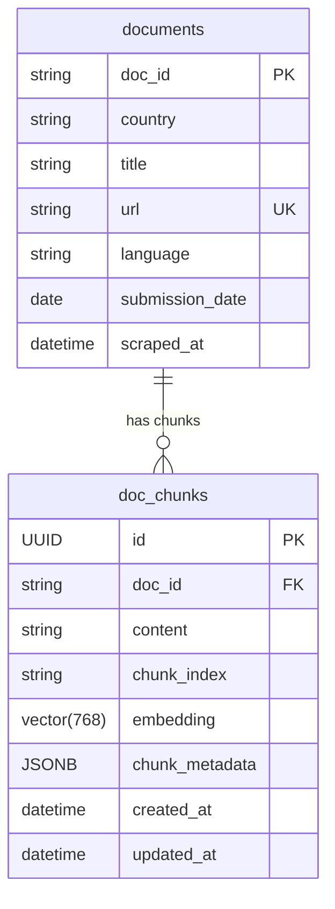
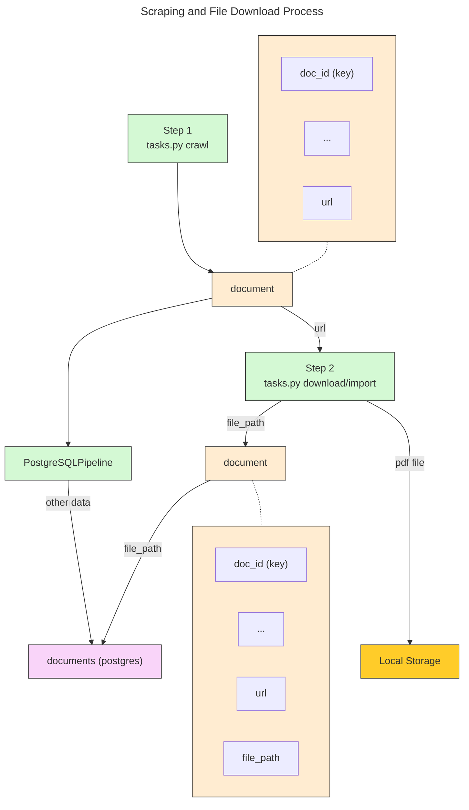
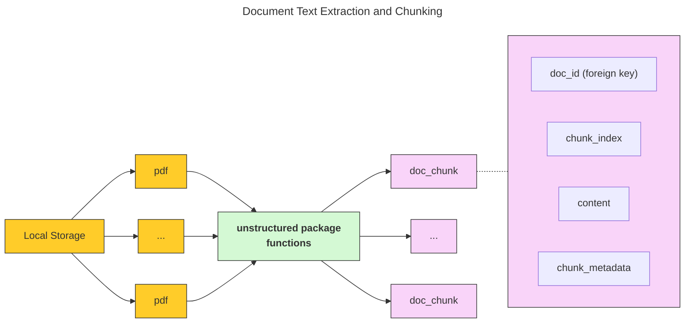
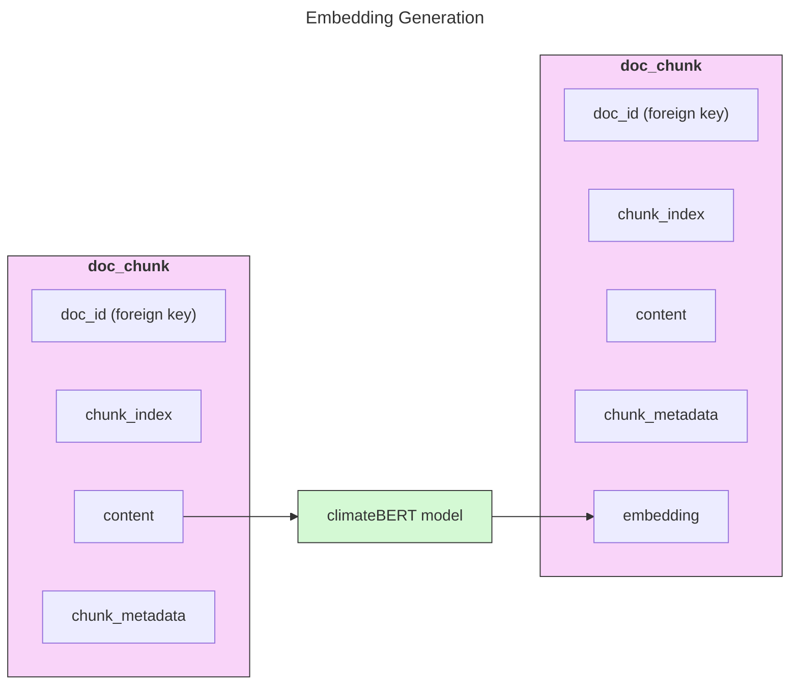
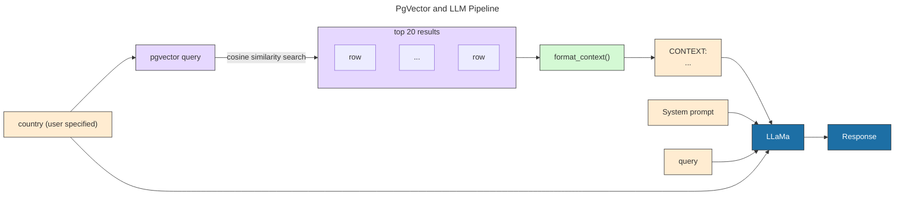

# Climate Policy Extractor: Technical Report

**AUTHOR:** Zicheng Liu

**DATE:** 4 April 2025

## Introduction
This project aims to extract and analyze climate policy documents from the NDC registry, focusing on the following key question:

**What emissions reduction target is each country in the NDC registry aiming for by 2030?**

The system comprises 4 main components:

1. Scraping and file download
2. Document text extraction and chunking
3. Embedding generation
4. Information extraction

## Database Schema

The postgres database consists of two tables: `documents` and `doc_chunks`. The `documents` table stores metadata about the documents, while the `doc_chunks` table stores the chunked content of each document along with the embeddings and additional metrics.

The diagram shows the most important fields in each table:

The `documents` table has a one-to-many relationship with the `doc_chunks` table, where each document can have multiple chunks of text associated with it. 

## 1. Scraping and File Download
The scraping process is implemented using `scrapy` spiders. The spider will crawl the UNFCCC NDC registry website and extract information from the NDC documents of each listed country.

The overall process for this step is illustrated in the diagram below:

## 2. Document Text Extraction and Chunking
The downloaded pdf documents are processed using the `unstructured` package, which provides a robust API for extracting and chunking text.

### Chunking Parameters

The `partition_pdf()` function is used to extract and chunk text from PDF documents. Below are the parameters used and their significance:

- **`chunking_strategy="by_title"`**: A new chunk starts whenever a title or section heading is detected. Ensures that chunks align with section boundaries, preserving the semantic structure of the document.

- **`multipage_sections=True`**: Allows sections to span across multiple pages, ensuring that content within the same section is not split unnecessarily by page breaks.

- **`max_characters=512`**: Sets a hard limit on the size of each chunk, aligning with the token limit of BERT-based models (512 tokens ≈ 512 characters). Ensures compatibility with the embedding model.

- **`new_after_n_chars=400`**: Defines a soft limit for chunk size. A new chunk is started after reaching this size, avoiding hitting the hard limit while maintaining meaningful context.

- **`combine_text_under_n_chars=150`**: Combines smaller elements (e.g. short paragraphs or titles) into larger chunks to avoid fragmentation and ensure better context for embeddings.

The following diagram illustrates the chunking process:

Each `doc_chunk` is stored as a row in the `doc_chunks` table, with the doc_id as a foreign key linking it to the original document.

## 3. Embedding Generation

The doc_chunks table is populated with embeddings using a pre-trained model. In this project, I used the `climatebert/distilroberta-base-climate-f` model from Hugging Face, which is specifically designed for climate-related text.

I used mean embeddings for the chunks, which are generated by averaging the token embeddings of each chunk. This approach is effective for capturing the overall semantic meaning of the text.

## 4. Information Extraction System

This pipeline comprises two parts: a pgvector similarity search filter, and an LLM for generating human-readable responses. To keep the LLM focused on each country, I used a country filter to limit the search space. The name of the country is specified by the user.

### PGVector Similarity Search

I first conducted a cosine similarity search using pgvector to find the top 20 most relevant chunks for the given query and country. The results are formatted into a context string, which is then passed to the LLM. 

### LLM Response

I used `Llama-3.1-70B-instruct` to combine the chunk context, query and system prompt to generate a response.

To avoid breaking my potato computer, I used Nebius as introduced in the lectures, to send API requests to the model, instead of running the model locally.

## 5. Evaluation

Due to lack of time, I was not able to formally implement metrics for measuring te success of my system. However, this can be done by:
- Counting how many countries we can answer questions about + how many questions we can answer about each country. Perhaps a frequency table can be plotted
- Manually checking the LLM responses and citations against the actual documents.

## 6. Further Enhancements

Some further improvements that can be made to the system include:

- **Improving the chunking process**: The current `unstructured` chunking process may not always produce optimal results. Experimenting with different text extraction and chunking strategies (such as the `hi-res` strategy) may yield better results.

- **Edge-case handling**: The current system does not handle documents that are not in PDF format. As stated in the [README](README.md), there are some countries which submitted word documents, which were skipped over by the pipeline.